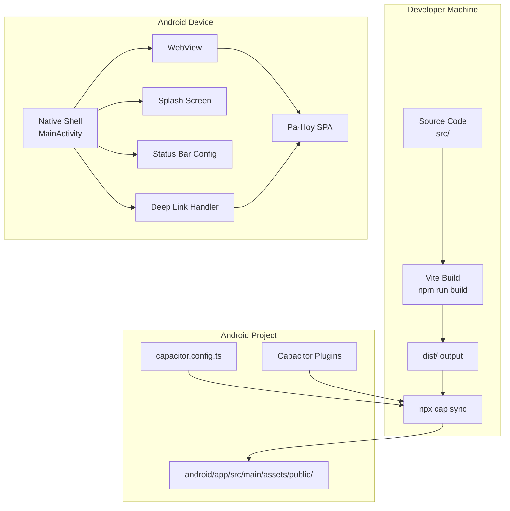

# Design Document: Capacitor Android Build

## Overview

This design wraps the existing Pa·Hoy React + Vite + Tailwind PWA into a Capacitor 6 native Android shell. The approach preserves the current SPA behavior (BrowserRouter, localStorage auth, service worker, safe-area insets) while adding native capabilities: a branded splash screen, adaptive icons, deep linking via Android App Links, and system bar styling.

The architecture follows the "shell app" pattern — the web app runs unchanged inside an Android WebView managed by Capacitor's runtime, with a thin native initialization layer that configures status bar appearance, splash screen timing, and deep link routing.

## Architecture



### Key Architectural Decisions

1. **Capacitor 6.x** — Chosen for its stable plugin ecosystem and wide community adoption. The `@capacitor/status-bar` plugin is still a separate package in v6 (merged into core in v7).

2. **Relative base path (`"./"`)** — Capacitor serves web assets from a local file server. Using relative paths ensures all JS/CSS/image imports resolve correctly from `file://` or the local Capacitor server.

3. **android/ committed to git** — While Capacitor's docs support both approaches, we commit the `android/` directory because the project requires custom `AndroidManifest.xml` intent filters for deep links and splash screen resource overrides. This also enables CI builds without running `npx cap add android` every time.

4. **Service worker preserved** — The Capacitor WebView supports service workers. The existing `registerSW()` call will execute without errors; however, caching strategies become less critical since assets are served locally. No code changes required.

5. **BrowserRouter unchanged** — Capacitor's server handles all routes by falling back to `index.html`, which is exactly what BrowserRouter needs. No hash router migration needed.

## Components and Interfaces

### 1. Capacitor Configuration (`capacitor.config.ts`)

```typescript
import type { CapacitorConfig } from "@capacitor/cli";

const config: CapacitorConfig = {
    appId: "com.pahoy.app",
    appName: "Pa·Hoy",
    webDir: "dist",
    server: {
        androidScheme: "https",
    },
    plugins: {
        SplashScreen: {
            launchShowDuration: 2000,
            launchAutoHide: true,
            launchFadeOutDuration: 300,
            backgroundColor: "#FFFFFF",
            androidSplashResourceName: "splash",
            androidScaleType: "CENTER_INSIDE",
            showSpinner: false,
            splashFullScreen: false,
            splashImmersive: false,
        },
    },
};

export default config;
```

**Design rationale:**
- `androidScheme: "https"` — Ensures the WebView treats the local server as a secure context, enabling service workers, localStorage, and other APIs that require HTTPS.
- `launchShowDuration: 2000` — 2 seconds provides a polished feel without excessive waiting (within the 1-3s range from Req 4.4).
- `launchAutoHide: true` — Splash dismisses automatically after the web app loads, no manual `SplashScreen.hide()` call needed.

### 2. Native Initialization Module (`src/utils/capacitor.ts`)

A platform-aware initialization module that configures native features on app boot.

```typescript
// src/utils/capacitor.ts
import { Capacitor } from "@capacitor/core";
import { StatusBar, Style } from "@capacitor/status-bar";
import { App } from "@capacitor/app";

export function isNative(): boolean {
    return Capacitor.isNativePlatform();
}

export async function initializeNativeApp(): Promise<void> {
    if (!isNative()) return;

    // Configure status bar: white bg with dark icons
    await StatusBar.setStyle({ style: Style.Light });
    await StatusBar.setBackgroundColor({ color: "#FFFFFF" });

    // Configure navigation bar (Android)
    // Handled via styles.xml in the native project
}

export function setupDeepLinkListener(navigate: (path: string) => void): void {
    if (!isNative()) return;

    App.addListener("appUrlOpen", ({ url }) => {
        const parsedUrl = new URL(url);
        const path = parsedUrl.pathname;

        // Only navigate for supported deep link patterns
        if (
            path.startsWith("/gig/") ||
            path.startsWith("/contracts/") ||
            path.startsWith("/messages/")
        ) {
            navigate(path);
        }
    });
}
```

### 3. Deep Link Integration (React Router)

The deep link listener integrates with React Router's `useNavigate` hook. It is initialized in the app's root component after authentication is confirmed.

```typescript
// Integration in src/main.tsx (inside BrowserRouter context)
import { initializeNativeApp, setupDeepLinkListener } from "@/utils/capacitor";

// Called once at app startup
useEffect(() => {
    initializeNativeApp();
}, []);

// Deep link listener with navigate
useEffect(() => {
    setupDeepLinkListener((path) => {
        // If not authenticated, store target and redirect to login
        if (!getToken()) {
            sessionStorage.setItem("deepLinkTarget", path);
            navigate("/login", { replace: true });
        } else {
            navigate(path, { replace: true });
        }
    });
}, [navigate]);
```

### 4. External Link Handler

Capacitor's WebView by default opens all navigations within the WebView. External links must be intercepted and opened in the system browser.

```typescript
// src/utils/capacitor.ts (addition)
import { Browser } from "@capacitor/browser";

export async function openExternalUrl(url: string): Promise<void> {
    if (isNative()) {
        await Browser.open({ url });
    } else {
        window.open(url, "_blank");
    }
}
```

Alternatively, Capacitor 6 can be configured to open external links automatically via the `server` config or by using the `@capacitor/browser` plugin. Given the app doesn't explicitly link to external URLs often, a utility function approach keeps control explicit.

### 5. Vite Configuration Changes

```typescript
// vite.config.ts — addition
export default defineConfig({
    base: "./",  // <-- Add relative base for Capacitor
    plugins: [/* ... existing plugins */],
    // ... rest unchanged
});
```

### 6. npm Scripts (`package.json`)

```json
{
    "scripts": {
        "cap:sync": "npx cap sync",
        "cap:open": "npx cap open android",
        "cap:build": "npm run build && npx cap sync && cd android && ./gradlew assembleDebug"
    }
}
```

**Note:** The `cap:build` script chains web build → Capacitor sync → Gradle debug APK assembly into a single command.

### 7. Android Project Structure (generated by `npx cap add android`)

```
android/
├── app/
│   ├── src/
│   │   └── main/
│   │       ├── AndroidManifest.xml        # App identity + deep link intent filters
│   │       ├── assets/public/             # Web assets (synced from dist/)
│   │       ├── java/com/pahoy/app/
│   │       │   └── MainActivity.java      # Extends BridgeActivity
│   │       └── res/
│   │           ├── drawable/splash.png     # Splash screen resource
│   │           ├── mipmap-mdpi/           # App icons per density
│   │           ├── mipmap-hdpi/
│   │           ├── mipmap-xhdpi/
│   │           ├── mipmap-xxhdpi/
│   │           ├── mipmap-xxxhdpi/
│   │           ├── values/
│   │           │   ├── strings.xml        # App label: "Pa·Hoy"
│   │           │   └── styles.xml         # Navigation bar color
│   │           └── xml/                   # Network security config
│   └── build.gradle                       # Module build config
├── build.gradle                           # Project build config
├── gradle.properties
├── settings.gradle
└── variables.gradle                       # SDK versions, Java version
```

### 8. Android Manifest Deep Link Configuration

```xml
<!-- android/app/src/main/AndroidManifest.xml -->
<activity android:name=".MainActivity" ...>
    <intent-filter android:autoVerify="true">
        <action android:name="android.intent.action.VIEW" />
        <category android:name="android.intent.category.DEFAULT" />
        <category android:name="android.intent.category.BROWSABLE" />
        <data android:scheme="https"
              android:host="pahoy.app"
              android:pathPrefix="/gig/" />
    </intent-filter>
    <intent-filter android:autoVerify="true">
        <action android:name="android.intent.action.VIEW" />
        <category android:name="android.intent.category.DEFAULT" />
        <category android:name="android.intent.category.BROWSABLE" />
        <data android:scheme="https"
              android:host="pahoy.app"
              android:pathPrefix="/contracts/" />
    </intent-filter>
    <intent-filter android:autoVerify="true">
        <action android:name="android.intent.action.VIEW" />
        <category android:name="android.intent.category.DEFAULT" />
        <category android:name="android.intent.category.BROWSABLE" />
        <data android:scheme="https"
              android:host="pahoy.app"
              android:pathPrefix="/messages/" />
    </intent-filter>
</activity>
```

### 9. Asset Generation Strategy

| Asset | Source | Tool | Output |
|-------|--------|------|--------|
| Adaptive icons | `public/icons/icon-512x512.png` | `@capacitor/assets` or `cordova-res` | `mipmap-*/ic_launcher.png`, `ic_launcher_round.png` |
| Splash screen | `public/splash-logo.png` | `@capacitor/assets` | `drawable-*/splash.png` per density bucket |

The `@capacitor/assets` CLI tool generates all required density variants from a single high-resolution source image:
- **mdpi**: 48×48 (icons), 480×800 (splash)
- **hdpi**: 72×72, 720×1280
- **xhdpi**: 96×96, 960×1600
- **xxhdpi**: 144×144, 1440×2560
- **xxxhdpi**: 192×192, 1920×3200

### 10. Android SDK Configuration (`android/variables.gradle`)

```gradle
ext {
    minSdkVersion = 23          // Android 6.0 (Marshmallow)
    compileSdkVersion = 34      // Android 14
    targetSdkVersion = 34
    androidxActivityVersion = '1.8.0'
    androidxAppCompatVersion = '1.6.1'
    androidxCoordinatorLayoutVersion = '1.2.0'
    androidxCoreVersion = '1.12.0'
    androidxFragmentVersion = '1.6.2'
    coreSplashScreenVersion = '1.0.1'
    androidxWebkitVersion = '1.9.0'
    javaVersion = JavaVersion.VERSION_17
}
```

## Data Models

### Deep Link Route Map

```typescript
interface DeepLinkRoute {
    pattern: RegExp;
    path: string;  // React Router path to navigate to
}

const DEEP_LINK_ROUTES: DeepLinkRoute[] = [
    { pattern: /^\/gig\/[\w-]+$/, path: "/gig/:id" },
    { pattern: /^\/contracts\/[\w-]+$/, path: "/contracts/:id" },
    { pattern: /^\/contracts\/[\w-]+\/confirm$/, path: "/contracts/:id/confirm" },
    { pattern: /^\/messages\/[\w-]+$/, path: "/messages/:roomId" },
];
```

### Capacitor Plugin Dependencies

| Plugin | Package | Purpose |
|--------|---------|---------|
| Core | `@capacitor/core` | Platform detection, native bridge |
| CLI | `@capacitor/cli` | Build tooling (dev dependency) |
| Splash Screen | `@capacitor/splash-screen` | Native splash on launch |
| Status Bar | `@capacitor/status-bar` | Status bar styling |
| App | `@capacitor/app` | Deep link events (`appUrlOpen`) |
| Browser | `@capacitor/browser` | Open external URLs in system browser |

### Safe Area Handling

The existing `pb-safe` utility class in the project uses the CSS `env(safe-area-inset-bottom)` value. This works natively in the Capacitor WebView because:
1. Capacitor sets the WebView to render edge-to-edge
2. The `viewport-fit=cover` meta tag is already implied by Capacitor's default HTML handling
3. The CSS `env()` values are populated by the Android system for devices with gesture navigation or notches

The `<meta name="viewport">` in `index.html` should be updated to include `viewport-fit=cover`:

```html
<meta name="viewport" content="width=device-width, initial-scale=1.0, viewport-fit=cover" />
```

And a CSS custom utility for `pb-safe` should be defined in `globals.css`:

```css
@utility pb-safe {
    padding-bottom: env(safe-area-inset-bottom, 0px);
}
```

## Correctness Properties

*A property is a characteristic or behavior that should hold true across all valid executions of a system — essentially, a formal statement about what the system should do. Properties serve as the bridge between human-readable specifications and machine-verifiable correctness guarantees.*

Most of this feature involves infrastructure configuration (Gradle, manifest, assets) and native plugin integration that are best tested via smoke tests and manual device testing. However, the deep link parsing and routing logic is pure function behavior suitable for property-based testing.

### Property 1: Deep link URL path extraction

*For any* valid deep link URL matching a supported pattern (`https://pahoy.app/gig/:id`, `https://pahoy.app/contracts/:id`, `https://pahoy.app/messages/:roomId`), the deep link handler SHALL extract the pathname and pass it unchanged to the navigation function.

**Validates: Requirements 7.2, 7.3, 7.4**

### Property 2: Unauthenticated deep link deferred navigation

*For any* valid deep link path received while the app has no authentication token, the handler SHALL store the target path in session storage and redirect to `/login`. After authentication is established, navigating to the stored path SHALL produce the originally intended deep link destination.

**Validates: Requirements 7.6**

## Error Handling

### Deep Link Errors

| Scenario | Handling |
|----------|----------|
| Deep link arrives while unauthenticated | Store target path in `sessionStorage`, redirect to `/login`, navigate to stored path after successful login |
| Deep link URL doesn't match any route | Ignore the event (don't navigate); app stays on current screen |
| Deep link target resource not found (404) | App's existing `<Route path="*">` catch-all shows the `NotFound` component |

### Native Plugin Errors

| Scenario | Handling |
|----------|----------|
| StatusBar plugin call fails (unlikely on Android) | Catch and log silently — the app remains fully functional without styling |
| SplashScreen auto-hide fails | Configured fallback: `launchShowDuration` ensures splash dismisses after max 2s regardless |
| App plugin listener registration fails | Log error; deep links won't work but in-app navigation is unaffected |
| Capacitor not available (web context) | All native calls guarded by `Capacitor.isNativePlatform()` — graceful no-op |

### Build Pipeline Errors

| Scenario | Handling |
|----------|----------|
| `npm run build` fails (TS errors) | Pipeline aborts before `cap sync`; developer fixes errors |
| `npx cap sync` fails (plugin mismatch) | Error message indicates which plugin version conflicts; resolve in `package.json` |
| `gradlew assembleDebug` fails | Gradle error output identifies the issue (SDK missing, Java version mismatch) |
| APK exceeds 30MB threshold | Review Vite bundle for large dependencies; enable code splitting; consider `vite-plugin-compression` |

## Testing Strategy

### Property-Based Tests (using `fast-check`)

The project already includes `fast-check` as a dev dependency. Property tests target the deep link parsing logic:

- **Property 1 — Deep link URL path extraction**: Generate random valid IDs (alphanumeric, UUID, slugs) for each supported pattern. Construct full URLs and verify the handler extracts the correct pathname.
  - Tag: **Feature: capacitor-android-build, Property 1: Deep link URL path extraction**
  - Minimum 100 iterations
- **Property 2 — Unauthenticated deep link deferred navigation**: Generate random valid deep link paths. Mock `getToken()` to return null. Verify the path is stored in sessionStorage and navigate is called with `/login`.
  - Tag: **Feature: capacitor-android-build, Property 2: Unauthenticated deep link deferred navigation**
  - Minimum 100 iterations

### Unit Tests

- **`isNative()` detection**: Mock `Capacitor.isNativePlatform()` to test conditional branching (2-3 examples)
- **External URL detection**: Verify known external URLs (`https://google.com`, `https://example.org`) are opened via Browser plugin, and internal URLs (`/home`, `/gig/123`) are handled in-app
- **StatusBar init calls**: Mock StatusBar plugin, call `initializeNativeApp()`, verify `setStyle({ style: Style.Light })` and `setBackgroundColor({ color: "#FFFFFF" })` are called
- **Deep link with non-matching URL**: Verify URLs that don't match any pattern are ignored (no navigation)

### Integration Tests

- **Build pipeline**: Verify `npm run build` produces a `dist/` directory with correct relative asset paths
- **Vite base path**: Verify that all asset references in built HTML/JS use `./` relative paths (not absolute `/`)
- **Capacitor sync**: Verify `npx cap sync` copies assets to `android/app/src/main/assets/public/`

### Manual Testing (Device)

- **Splash screen**: Verify logo displays centered on white background, dismisses within 1-3 seconds
- **Status bar**: Verify white background with dark icons on all screens
- **Navigation bar**: Verify white background with dark system buttons
- **Deep links**: Test via `adb shell am start -a android.intent.action.VIEW -d "https://pahoy.app/gig/123"`
- **External links**: Verify external URLs open in Chrome/default browser
- **Safe areas**: Verify bottom navigation and fixed CTAs are not obscured by gesture navigation bar
- **localStorage persistence**: Verify auth tokens survive app kill and restart
- **Service worker**: Verify no console errors from SW registration; offline caching operates normally

### APK Size Verification

The debug APK must remain under 30MB. Expected breakdown:
- Web assets (JS + CSS + images): ~5-8MB
- Capacitor runtime + plugins: ~2-3MB
- Android framework overhead: ~3-5MB
- **Total estimated**: ~12-18MB (well within limit)
