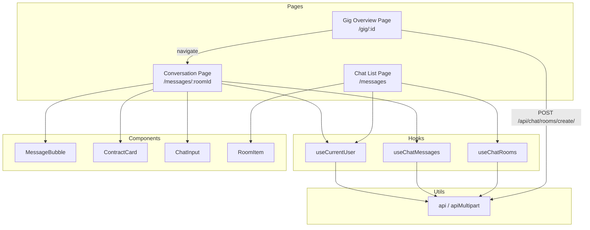
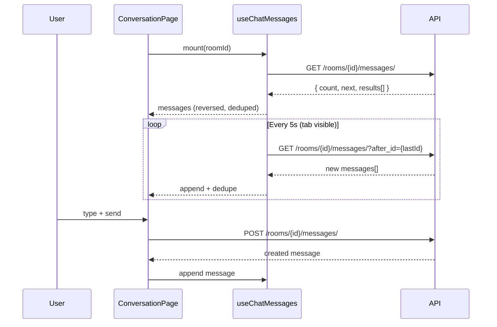

# Design Document: Chat Feature

## Overview

The chat feature enables real-time messaging between clients and talent (gig owners) within the Pa·Hoy app. It introduces two new pages (Chat List and Conversation), custom hooks for data fetching and polling, and modifications to existing pages for room creation flow.

The system follows a polling-based synchronization strategy (5-second interval) since the backend does not currently support WebSockets. All state is managed locally via React hooks — no global state management is needed given the feature's scope.

### Key Design Decisions

| Decision | Rationale |
|----------|-----------|
| Polling over WebSocket | Backend only supports REST; polling is sufficient for MVP and can be swapped later |
| Local state via hooks | Feature is self-contained; no cross-page state sharing needed beyond URL params |
| `after_id` cursor for sync | Avoids page-number staleness issues; only fetches genuinely new messages |
| Deduplication by UUID map | O(1) lookups prevent duplicate rendering during page merges and poll overlaps |
| Separate `use-current-user` hook | Reusable across chat list (participant resolution) and conversation (alignment logic) |

## Architecture



### Data Flow — Conversation View



## Components and Interfaces

### Pages

#### `src/pages/chat-list.tsx` — ChatList

Renders the list of all chat rooms for the authenticated user.

```typescript
// Props: none (data fetched via hooks)
// Route: /messages
// Guards: RequireAuth → RequireOnboarding → PageTransition
// Bottom nav: visible
```

**Responsibilities:**
- Fetches rooms via `useChatRooms`
- Resolves "other participant" name using `useCurrentUser`
- Renders `RoomItem` for each room
- Handles empty state, loading state, error state with retry
- Infinite scroll for pagination (200px threshold)

#### `src/pages/chat-conversation.tsx` — ChatConversation

Renders the message thread for a single room.

```typescript
// Props: none (roomId from useParams)
// Route: /messages/:roomId
// Guards: RequireAuth → RequireOnboarding → PageTransition
// Bottom nav: hidden (added to NO_NAV_ROUTES)
```

**Responsibilities:**
- Fetches messages via `useChatMessages`
- Determines message alignment via `useCurrentUser`
- Renders `MessageBubble` or `ContractCard` based on message.contract
- Manages chat input and message sending
- Displays header with other participant's name and back button
- Handles infinite scroll upward for older messages

### Hooks

#### `src/hooks/use-current-user.ts`

```typescript
interface CurrentUser {
  id: string; // UUID
}

interface UseCurrentUserReturn {
  user: CurrentUser | null;
  isLoading: boolean;
  error: boolean;
}

function useCurrentUser(): UseCurrentUserReturn;
```

- Calls `GET /api/auth/user/` on mount
- Caches result in a module-level variable to avoid redundant fetches across components
- Returns user UUID for sender comparison and participant resolution

#### `src/hooks/use-chat-rooms.ts`

```typescript
interface ChatRoom {
  id: string;
  name: string;
  participants: string[];
  participant_names: string[];
  last_message: string | null;
  client_user: string;
  gig: string;
  is_active: boolean;
  created_at: string;
}

interface UseChatRoomsReturn {
  rooms: ChatRoom[];
  isLoading: boolean;
  isLoadingMore: boolean;
  error: string | null;
  hasMore: boolean;
  loadMore: () => void;
  retry: () => void;
}

function useChatRooms(): UseChatRoomsReturn;
```

- Fetches initial page from `GET /api/chat/rooms/`
- Tracks `next` URL for pagination
- Appends results on `loadMore()` without replacing existing rooms
- Prevents duplicate concurrent requests via a loading flag

#### `src/hooks/use-chat-messages.ts`

```typescript
interface Message {
  id: string;
  room: string;
  contract: string | null;
  sender: string;
  sender_username: string;
  content: string;
  attachment: string | null;
  timestamp: string;
}

interface UseChatMessagesReturn {
  messages: Message[];
  isLoading: boolean;
  isLoadingOlder: boolean;
  error: string | null;
  hasOlderMessages: boolean;
  loadOlderMessages: () => void;
  sendMessage: (content: string, attachment?: File) => Promise<boolean>;
  isSending: boolean;
  sendError: string | null;
}

function useChatMessages(roomId: string): UseChatMessagesReturn;
```

- Fetches initial page, reverses results for chronological display
- Maintains a `Map<string, Message>` internally for O(1) deduplication
- Exposes a sorted array (timestamp ascending, UUID tie-breaker)
- Polls every 5 seconds using `after_id` of the last message
- Pauses polling when `document.hidden` is true; resumes with immediate poll on visibility change
- Cancels in-flight requests on unmount via `AbortController`
- `sendMessage` uses `apiMultipart` when attachment is present, `api` otherwise

### UI Components

#### `src/components/application/chat/message-bubble.tsx`

```typescript
interface MessageBubbleProps {
  content: string;
  senderUsername: string;
  timestamp: string;       // ISO string
  isOwnMessage: boolean;   // determines alignment and color
  attachment?: string | null;
}
```

- Right-aligned with `bg-brand-50` + `text-brand-700` border for own messages
- Left-aligned with `bg-neutral-50` + `text-neutral-700` border for other messages
- Shows `sender_username` above bubble in `text-xs text-tertiary`
- Shows formatted timestamp below bubble in `text-xs text-tertiary`

#### `src/components/application/chat/contract-card.tsx`

```typescript
interface ContractCardProps {
  contractId: string;
  isOwnMessage: boolean;
  isClient: boolean;       // current user is client_user of the room
  timestamp: string;
}
```

- If `isOwnMessage && !isClient` (talent sent it): renders "Contrato enviado" text in brand-red, right-aligned
- If `isClient`: fetches contract details from `GET /api/contracts/retrieve/{id}/`, displays card with price, status badge, action area (placeholder), left-aligned
- Error state: shows "Detalles del contrato no disponibles" with timestamp

#### `src/components/application/chat/chat-input.tsx`

```typescript
interface ChatInputProps {
  onSend: (content: string, attachment?: File) => Promise<boolean>;
  isSending: boolean;
  sendError: string | null;
  isGigOwner: boolean;     // shows "Send Contract" placeholder button
}
```

- Text input with 10,000 character limit
- Send button disabled when input is empty/whitespace or `isSending`
- Character counter shown when approaching limit (>9,500 chars)
- Shows inline error below input on send failure
- Optional "Send Contract" button (non-functional) when `isGigOwner` is true

#### `src/components/application/chat/room-item.tsx`

```typescript
interface RoomItemProps {
  otherParticipantName: string;
  lastMessage: string | null;
  createdAt: string;
  onClick: () => void;
}
```

- Displays participant name, truncated last_message (max 80 chars with "…"), and formatted timestamp
- Tappable row navigating to conversation

## Data Models

### TypeScript Interfaces

```typescript
// src/types/chat.ts

export interface ChatRoom {
  id: string;
  name: string;
  participants: string[];        // UUID[]
  participant_names: string[];
  last_message: string | null;
  client_user: string;           // UUID
  gig: string;                   // UUID
  is_active: boolean;
  created_at: string;            // ISO datetime
}

export interface Message {
  id: string;                    // UUID
  room: string;                  // UUID
  contract: string | null;       // UUID or null
  sender: string;                // UUID
  sender_username: string;
  content: string;
  attachment: string | null;     // URI or null
  timestamp: string;             // ISO datetime
}

export interface Contract {
  id: string;
  gig: string;
  client: string;
  status: "Activo" | "Concluido" | "Confirmado" | "Disputa" | "Cancelado" | "Propuesta";
  price: number;
  price_type: string;
  created_at: string;
  updated_at: string;
}

export interface PaginatedResponse<T> {
  count: number;
  next: string | null;
  previous: string | null;
  results: T[];
}
```

### State Shape (per hook)

```typescript
// useChatMessages internal state
interface ChatMessagesState {
  messagesById: Map<string, Message>;  // deduplication store
  sortedIds: string[];                 // ordered by timestamp + id
  nextPageUrl: string | null;          // for older messages
  lastMessageId: string | null;        // for after_id polling
  isLoading: boolean;
  isLoadingOlder: boolean;
  isSending: boolean;
  error: string | null;
  sendError: string | null;
}
```

## Correctness Properties

*A property is a characteristic or behavior that should hold true across all valid executions of a system — essentially, a formal statement about what the system should do. Properties serve as the bridge between human-readable specifications and machine-verifiable correctness guarantees.*

### Property 1: Message ordering is consistent

*For any* set of messages with arbitrary timestamps and UUIDs, the sorted display order SHALL always be ascending by `timestamp`, using the message `id` (UUID string comparison) as a tie-breaker when two messages share the same timestamp.

**Validates: Requirements 2.1, 4.2**

### Property 2: Message alignment is determined by sender identity

*For any* message and any current user UUID, the message SHALL be right-aligned if and only if `message.sender === currentUser.id`, and left-aligned otherwise. This property holds regardless of the message content, timestamp, or contract field.

**Validates: Requirements 2.2, 2.3**

### Property 3: Timestamp formatting threshold

*For any* message timestamp, the formatted display string SHALL use relative time format (e.g., "hace 5 min") if the timestamp is less than 24 hours from the current time, and SHALL use absolute format "DD/MM/YYYY HH:mm" otherwise.

**Validates: Requirements 2.4**

### Property 4: Message deduplication preserves uniqueness

*For any* two arrays of messages (potentially overlapping), merging them by UUID SHALL produce a result where each message `id` appears exactly once, and the total count equals the number of unique UUIDs across both input arrays.

**Validates: Requirements 2.9, 4.3**

### Property 5: Message content validation

*For any* string input, the message SHALL be considered valid for sending if and only if it contains at least one non-whitespace character AND its length does not exceed 10,000 characters. All other inputs (empty, whitespace-only, or exceeding 10,000 chars) SHALL be rejected.

**Validates: Requirements 3.2, 3.6, 3.7**

### Property 6: Other participant name resolution

*For any* chat room with a `participant_names` array and a current user UUID with a corresponding username, the resolved "other participant name" SHALL be the entry in `participant_names` that does not correspond to the current user's position in the `participants` array.

**Validates: Requirements 5.1, 7.2**

### Property 7: Contract message rendering mode

*For any* message, the rendering mode SHALL be "contract card" if and only if `message.contract !== null`. Messages with `contract === null` SHALL always render as regular text bubbles regardless of content.

**Validates: Requirements 6.1**

### Property 8: Message preview truncation

*For any* string used as a last_message preview, if the string length exceeds 80 characters, the displayed text SHALL be the first 80 characters followed by "…" (ellipsis). If the string is 80 characters or fewer, it SHALL be displayed in full without modification.

**Validates: Requirements 7.2**

## Error Handling

### Error Categories and Responses

| Error Type | Source | User-Facing Behavior |
|-----------|--------|---------------------|
| 401 Unauthorized | Any API call | Redirect to splash (`/`) via `api()` utility (automatic) |
| 400 Bad Request | Room creation | Inline error below "Chatear" button; button re-enabled |
| 404 Not Found | Messages fetch | "Conversación no disponible" error; stop further fetches |
| 5xx Server Error | Any API call | "Error de conexión" message with retry action |
| Network failure | Any API call | "Sin conexión" message; retry on next poll cycle or manual retry |
| Poll failure (non-401) | Polling cycle | Silent skip; retry next interval; keep existing messages |
| Contract fetch failure | Contract card | Fallback card layout: "Detalles no disponibles" |
| Send message failure | Message POST | Inline error below input; text preserved; send button re-enabled |

### Error Recovery Strategy

- **Polling resilience:** Failed polls do not clear state. The system silently retries on the next interval.
- **Optimistic-free sending:** Messages are not shown until the server confirms (201). This avoids reconciliation complexity while the system lacks delivery guarantees.
- **Graceful degradation:** Contract cards show a fallback when contract details can't be fetched. The message itself remains visible with timestamp.
- **Timeout protection:** Room creation disables the button for a maximum of 15 seconds. If no response arrives, the button re-enables with a timeout error.

## Testing Strategy

### Property-Based Tests (Vitest + fast-check)

Each correctness property will be implemented as a property-based test using `fast-check` with Vitest. Each test runs a minimum of 100 iterations.

**Library:** `fast-check` (well-maintained, TypeScript-native, works with Vitest)

**Test files:**
- `src/hooks/__tests__/chat-properties.test.ts` — Properties 1, 4, 5, 6, 8
- `src/components/application/chat/__tests__/chat-render-properties.test.ts` — Properties 2, 3, 7

**Tag format for each test:**
```typescript
// Feature: chat-feature, Property 1: Message ordering is consistent
```

### Unit Tests (Vitest)

Example-based tests for specific scenarios:

- Room creation flow: success (200/201), 400 error, network error
- Empty states: no rooms, no messages
- Loading states: initial load, older messages load, send in progress
- Edge cases: null last_message, anonymized usernames, null contract
- Character limit enforcement at 10,000 chars

### Integration Tests

- Route registration: `/messages` and `/messages/:roomId` render correct components
- Auth guard: unauthenticated access redirects to `/`
- Onboarding guard: incomplete profile redirects to `/complete-profile`
- Bottom nav visibility: shown on `/messages`, hidden on `/messages/:roomId`
- Gig Overview "Chatear" button: hidden when user is gig owner

### Test Configuration

```typescript
// vitest.config.ts additions
{
  test: {
    environment: 'jsdom',
    setupFiles: ['./src/test-setup.ts'],
  }
}
```

Pure utility functions (ordering, deduplication, validation, formatting, truncation, participant resolution) will be extracted into `src/utils/chat.ts` to make them independently testable without DOM dependencies.
