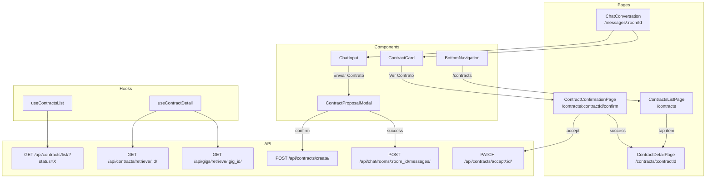

# Design Document: Contracts Feature

## Overview

The Contracts feature adds a complete contract lifecycle to Pa·Hoy, enabling Talents to propose service agreements from chat conversations and Clients to review, accept, and track those contracts. The implementation builds on the existing chat infrastructure (`useChatMessages`, `ContractCard`, `ChatInput`), the app's routing system (React Router 7 with `RequireAuth` and `RequireOnboarding` guards), and the established UI component library (React Aria, Motion, Untitled UI icons, Tabs, Modals).

The feature introduces:
- A **Contract Proposal Modal** triggered from chat input (Talent-side)
- An enhanced **Contract Card** in chat with navigable action (Client-side)
- A **Contract Confirmation Page** for accepting proposals
- A **Contracts List Page** with tab-based status filtering and infinite scroll
- A **Contract Detail Page** with timeline and gig context
- **Routing integration** with auth guards, bottom navigation active state, and NO_NAV_ROUTES

## Architecture



### Data Flow

1. **Proposal**: Talent opens modal → enters price → `POST /contracts/create/` → `POST /chat/rooms/:id/messages/` with contract UUID → message appears in chat
2. **Review**: Client sees `ContractCard` → taps "Ver Contrato" → navigates to `/contracts/:id/confirm`
3. **Accept**: Client taps CTA → `PATCH /contracts/accept/:id/` → navigates to `/contracts/:id` (detail page)
4. **List**: User navigates to `/contracts` → hook fetches contracts by status → renders tabbed list with infinite scroll
5. **Detail**: User navigates to `/contracts/:id` → fetches contract + gig details → renders timeline + info

## Components and Interfaces

### 1. ContractProposalModal

**Location:** `src/components/application/chat/contract-proposal-modal.tsx`

```typescript
interface ContractProposalModalProps {
  isOpen: boolean;
  onClose: () => void;
  onSuccess: (message: Message) => void;
  roomId: string;
  gig: {
    id: string;
    name: string;
    price: number | null;
    price_type: string;
  };
}
```

**Behavior:**
- Uses `ModalOverlay` + `Modal` + `Dialog` from `@/components/application/modals/modal`
- Pre-fills gig name (read-only), price, and price_type from gig data
- If `gig.price` is null, price field starts empty and is required
- Price input: numeric decimal, min 0.01, max 999,999,999.99
- Price type: radio group with "Fijo" / "Horas" options
- Client-side validation on confirm (empty/non-numeric price → field error, no API call)
- On confirm: sequential `POST /contracts/create/` then `POST /chat/rooms/:id/messages/`
- Loading state: spinner on button, inputs disabled
- Error mapping: field-level errors from 400 response displayed on respective fields
- On success: calls `onSuccess(message)`, closes modal

### 2. ContractCard (Enhanced)

**Location:** `src/components/application/chat/contract-card.tsx` (existing, to be updated)

**Changes:**
- When `status === "Propuesta"` and user is Client: "Ver Contrato" button is **enabled** and navigates to `/contracts/:contractId/confirm`
- When `status !== "Propuesta"`: "Ver Contrato" button remains **disabled**
- When contract `price` is null: show "Precio no definido" placeholder
- Add "Reintentar" button on error state to re-fetch contract details
- Uses `useNavigate()` for navigation on button tap

### 3. ChatInput (Enhanced)

**Location:** `src/components/application/chat/chat-input.tsx` (existing, to be updated)

**Changes:**
- "Enviar Contrato" button becomes functional (remove `disabled` prop)
- Add `onSendContract` callback prop to trigger modal open
- Props addition:
```typescript
interface ChatInputProps {
  // ...existing
  onSendContract?: () => void; // triggers proposal modal
}
```

### 4. ContractConfirmationPage

**Location:** `src/pages/contract-confirmation.tsx`

```typescript
// Route: /contracts/:contractId/confirm
```

**Layout:**
- Mobile-first full-height: `min-h-dvh flex flex-col bg-white`
- Header with back button (ChevronLeft) + title "Confirmar Contratación"
- Content area with `motion.div` entrance animation
- Gig image (front_image), gig name, talent name + badge, rating, distance
- Contract price (formatted currency), price type label
- Status badge
- Bottom-pinned CTA: "Sí, contratar a {talent_first_name}" with checkmark icon
- Loading state: centered `LoadingIndicator`
- Error state: error message + back navigation
- Accept in-progress: button shows "Confirmando..." with spinner, disabled

### 5. ContractsListPage

**Location:** `src/pages/contracts-list.tsx`

```typescript
// Route: /contracts
```

**Layout:**
- Page header: "Contratos" title
- `Tabs` component with two tabs: "En Curso" (default), "Historial"
- "En Curso": fetches status "Activo" + "Confirmado" (two parallel requests, merged by `updated_at` desc)
- "Historial": fetches status "Concluido" + "Cancelado" (same pattern)
- Each card: gig thumbnail, gig name, counterparty name + badge, relative date, status icon, price
- Tap item → navigate to `/contracts/:contractId`
- Infinite scroll: loads next page when scroll is within 200px of bottom
- Empty state: illustration + message per tab
- Loading state: skeleton placeholders
- Error state: error message + retry button

### 6. ContractDetailPage

**Location:** `src/pages/contract-detail.tsx`

```typescript
// Route: /contracts/:contractId
```

**Layout:**
- Header: back button (ChevronLeft) + title "Detalle de contratación"
- Status badge (colored by status)
- Price + price type
- Timeline progress indicator (lifecycle steps: Propuesta → Activo → Confirmado → Concluido)
- Gig info: name, talent name
- Created/updated dates (locale-formatted: "miércoles 23 de julio")
- If status "Activo" or "Confirmado": "Cancelar contratación" button at bottom
- Loading state: centered spinner
- Error (404/401): error message + back button

### 7. Custom Hooks

#### `useContractsList`

**Location:** `src/hooks/use-contracts-list.ts`

```typescript
interface UseContractsListReturn {
  contracts: ContractListItem[];
  isLoading: boolean;
  error: string | null;
  hasMore: boolean;
  loadMore: () => void;
  retry: () => void;
}

function useContractsList(statuses: Contract["status"][]): UseContractsListReturn;
```

- Fetches one request per status value, merges results sorted by `updated_at` desc
- Page-number pagination (20 results/page per status)
- Infinite scroll support via `loadMore()`
- Deduplication by contract ID

#### `useContractDetail`

**Location:** `src/hooks/use-contract-detail.ts`

```typescript
interface UseContractDetailReturn {
  contract: Contract | null;
  gig: GigDetail | null;
  isLoading: boolean;
  error: string | null;
  retry: () => void;
}

function useContractDetail(contractId: string): UseContractDetailReturn;
```

- Fetches contract from `GET /api/contracts/retrieve/:id/`
- Then fetches gig from `GET /api/gigs/retrieve/:gig_id/` using contract's gig UUID
- Returns both, with loading/error states

## Data Models

### Contract (existing, from `src/types/chat.ts`)

```typescript
interface Contract {
  id: string;
  gig: string;        // UUID reference to Gig
  client: string;     // UUID reference to Client user
  status: "Activo" | "Concluido" | "Confirmado" | "Disputa" | "Cancelado" | "Propuesta";
  price: number;
  price_type: string; // "Fijo" | "Horas"
  created_at: string; // ISO datetime
  updated_at: string; // ISO datetime
}
```

### ContractListItem (extended for list view)

```typescript
interface ContractListItem extends Contract {
  gig_name: string;
  gig_front_image: string | null;
  counterparty_name: string;
  counterparty_verified: boolean;
}
```

> Note: If the API does not return nested gig/counterparty fields in the list endpoint, the `useContractsList` hook will need to fetch gig details per contract or the UI will display only the contract UUID. The design assumes the list endpoint returns sufficient data for card rendering. If not, a follow-up enrichment step per card will be needed.

### GigDetail (for confirmation and detail pages)

```typescript
interface GigDetail {
  id: string;
  name: string;
  description: string;
  price: number | null;
  price_type: string;
  front_image: string | null;
  talent: string;       // UUID
  talent_info: {
    first_name: string;
    last_name: string;
    is_verified: boolean;
    rating: number | null;
    profile_picture: string | null;
  };
}
```

### CreateContractPayload

```typescript
interface CreateContractPayload {
  gig: string;          // UUID
  price: number;
  price_type: "Fijo" | "Horas";
}
```

### AcceptContractResponse

```typescript
interface AcceptContractResponse extends Contract {
  status: "Activo"; // after acceptance
}
```

### Contract Timeline Steps

```typescript
const CONTRACT_TIMELINE_STEPS = [
  { key: "Propuesta", label: "Propuesta enviada" },
  { key: "Activo", label: "Contrato activo" },
  { key: "Confirmado", label: "Trabajo confirmado" },
  { key: "Concluido", label: "Concluido" },
] as const;
```

The timeline marks steps as complete based on status ordering. For "Cancelado" and "Disputa", a special indicator breaks the normal flow.

## Correctness Properties

*A property is a characteristic or behavior that should hold true across all valid executions of a system — essentially, a formal statement about what the system should do. Properties serve as the bridge between human-readable specifications and machine-verifiable correctness guarantees.*

### Property 1: Price validation rejects invalid inputs

*For any* string that is empty, purely whitespace, non-numeric, less than 0.01, or greater than 999,999,999.99, the contract proposal modal SHALL reject the input and display a validation error without making an API request.

**Validates: Requirements 1.2, 1.9**

### Property 2: Successful contract creation always produces a chat message

*For any* valid contract creation (API returns 201), the system SHALL send a follow-up message to the chat room containing the returned contract UUID, resulting in the message being appended to the conversation.

**Validates: Requirements 1.4, 1.5**

### Property 3: Contract card display respects status-based button state

*For any* contract displayed in a Contract Card, the "Ver Contrato" button SHALL be enabled if and only if the contract status equals "Propuesta".

**Validates: Requirements 2.3, 2.4**

### Property 4: Contract card visibility depends on sender identity

*For any* chat message with a non-null contract field, IF the authenticated user's UUID matches the message sender UUID THEN the display SHALL be "Contrato enviado" label; otherwise the display SHALL be the full Contract Card component.

**Validates: Requirements 2.8, 2.9**

### Property 5: Tab filter returns only contracts with matching statuses

*For any* selection of the "En Curso" tab, all displayed contracts SHALL have status "Activo" or "Confirmado"; for any selection of the "Historial" tab, all displayed contracts SHALL have status "Concluido" or "Cancelado".

**Validates: Requirements 4.2, 4.3**

### Property 6: Contracts list is sorted by updated_at descending

*For any* list of contracts displayed in the Contracts List Page (regardless of tab), each contract's `updated_at` SHALL be greater than or equal to the `updated_at` of the contract below it in the list.

**Validates: Requirements 4.1, 4.3**

### Property 7: Timeline completion reflects status ordering

*For any* contract with a given status, all timeline steps preceding that status in the lifecycle order (Propuesta → Activo → Confirmado → Concluido) SHALL be marked as complete, and subsequent steps SHALL be marked as pending.

**Validates: Requirements 5.3**

### Property 8: Currency formatting preserves numeric value

*For any* contract price value, formatting it as currency (e.g., "$1,500.00") and parsing it back SHALL yield the original numeric value.

**Validates: Requirements 2.1, 4.4, 5.2**

## Error Handling

| Scenario | Behavior |
|----------|----------|
| Contract creation API returns 400 | Map field errors to modal form fields, keep modal open |
| Contract creation succeeds but message API fails | Close modal, contract message appears on next poll cycle |
| Contract retrieve returns 404 | Show "Contrato no encontrado" with back navigation |
| Contract retrieve returns 401 | Redirect to splash (handled by `api()` utility) |
| Contract accept returns 400/401 | Show error below CTA in `text-error-primary`, stay on page |
| Contracts list API error | Show error message with "Reintentar" button |
| Network failure (any request) | Show generic "Error de conexión" with retry option |
| Price input exceeds max/below min | Client-side validation error on field, no API call |

### Loading States

- **ContractProposalModal**: Confirm button shows spinner + "Enviando...", inputs disabled
- **ContractCard**: Skeleton placeholder (animated pulse) matching card dimensions
- **ContractConfirmationPage**: Centered `LoadingIndicator` replacing content area
- **ContractsListPage**: Skeleton cards in list area
- **ContractDetailPage**: Centered `LoadingIndicator`

### Optimistic Updates

No optimistic updates are used in this feature. All state changes wait for API confirmation to ensure data integrity, given the financial nature of contracts.

## Testing Strategy

### Unit Tests (Vitest + Testing Library)

- **ContractProposalModal**: Validates client-side price validation logic (empty, non-numeric, out of range)
- **ContractCard**: Tests render variants (own message vs client view, loading, error, status-based button state)
- **ContractConfirmationPage**: Tests CTA button states, error rendering
- **ContractsListPage**: Tests tab switching, empty state, error state
- **ContractDetailPage**: Tests timeline rendering for each status, error state
- **useContractsList**: Tests merge logic, sort order, pagination
- **useContractDetail**: Tests sequential fetching, error propagation

### Property-Based Tests (fast-check)

Each correctness property maps to a property-based test with minimum 100 iterations:

- **Feature: contracts-feature, Property 1**: Generate random strings (empty, whitespace, non-numeric, out-of-range numbers) → validate rejection
- **Feature: contracts-feature, Property 3**: Generate random Contract objects with varying statuses → verify button enabled iff status === "Propuesta"
- **Feature: contracts-feature, Property 5**: Generate arrays of Contract objects with mixed statuses → filter by tab → verify only matching statuses remain
- **Feature: contracts-feature, Property 6**: Generate arrays of contracts with random `updated_at` dates → sort → verify descending order
- **Feature: contracts-feature, Property 7**: Generate random contract statuses → compute timeline → verify completion correctness
- **Feature: contracts-feature, Property 8**: Generate random valid price numbers → format → parse → verify round-trip equality

### Integration Tests

- Contract proposal flow: modal open → fill price → confirm → verify API calls sequence
- Contract acceptance flow: navigate to confirm page → accept → verify navigation to detail
- Tab switching: verify correct API calls per tab selection

### Test Configuration

- Library: `fast-check` (already in devDependencies)
- Runner: `vitest --run`
- Minimum iterations per property: 100
- Each test tagged with: `// Feature: contracts-feature, Property N: {text}`
